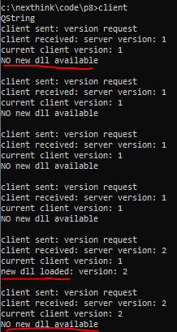
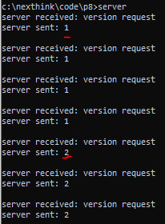

# nexthink
client-server and load lib exercise

Manel Carrera  
2020-09-27

# 1. Introduction

## Goal

### My approach

1. client asks (pools) server every 5 seconds for the current dll version.
2. server replies 3x times 1 and then 2x times 2
3. if version is newer than teh curertn one, client loads the dll present in the local folder 'artifacts' and shows the version by calling the `get_version` method implemend on it

### How to run it

1. git clone git@github.com:manelcarrera/nexthink.git
2. run server or client
3. run the other
4. you w1ll see logs below
5. gracefully quit the client by Ctrl+C
6. not-gracefully quit the server by Ctrl+C

# 2. Mult-platform
No, Windows-only

# 3. Operational system
Windows 10

# 4. Compiler
* mingw-18.0
* make all builds server.exe, client.exe, shared_lib_v1.dll adn shared_lib_v2.dll

# Makefile
* Not used CMake as I'm not used to / I know NexThink uses it for the `collector`
* Basic Makefile 

# 5. Libs
Used libs

## 5a. BOOST
* boost_1_77_0
* compiled by me with mingw
* Linked (static) boost_system and boost_thread libs
* bost/assio is a headers-only lib so nothing to be linked

## 5b. Qt
* Qt 6.3.1
* Used pre-compiled libs for mingw_64
* Finally not used as is not straight forward to link the lib and I wanted to keep solution simple
Qt libs have dependencies with other system libs: libstdc++-6.dll, libgcc_s_seh-1.dll and libwinpthread-1.dll

# 6. Files structure

* code
    * cpp
        * server.cpp
        * client.cpp
        * shared_lib_v1.cpp
        * shared_lib_v2.cpp
    * h
        * shared_lib_v2.h
* obj (hidden)
    * client.o
    * server.o
    * shared_lib_v1.o
    * shared_lib_v2.o

* artifacts
    * shared_lib_v1.dll (generated)
    * shared_lib_v2.dll (generated)
* Mafefile
* server.exe (generated)
* client.exe (generated)
* libshared_lib_v2.a (generated)

# 7. Binaries

## 7a. server.exe

* Launches a thread with a boost tcp listener on ip 127.0.0.1, port 1234
* Receives latest avialable version requests sent by the client
* Replies 3x times 1 and then 2

## 7b. client.exe

* Launches a thread that polls for last available version every 5 seconds to the ip 127.0.0.1, port 1234
* If server not listening on that ip and port client does not die
* Current dll version is 1
* For three times server says latest dll available version is 1 so client does nothing
* Fourth time server says latest dll version is 2 so client loads shared_liv_v2.dll, calls method get_version and prints the retrurbed value (2) and says new version
* Fifth time server says latest dll version is 2 so client does nothing as the current dll version is the latest

## 7c. shared_lib_v1.dll

* dll with only one method: get_version that returns 1

## 7d. shared_lib_v2.dll

* dll with only one method: get_version that returns 2

# 8. Improvements
* Simple no-concurrent tcp client-server  
concurerncy to be implemented
* Client does everything in the 'latest available dll request' polling thread  
it loads the new dll  
polling thread shound be dedicated and notify the main thread to load the new dll
* dll is not downloaded from anywhere, just taken from the artifacts folder
* Implemntation is Windsows-only  
It should be multi-platform
* UT to be done, with GoggleMoch for example
* Code to be commented
* Gracefully shutdown the server

# 9. References
* [Installing boost on Windows using MinGW-w64 (gcc 64-bit)](https://gist.github.com/zrsmithson/0b72e0cb58d0cb946fc48b5c88511da8)
* [MinGW Distro - nuwen.net](https://nuwen.net/mingw.html)
* [boost Version 1.80.0](https://www.boost.org/users/history/version_1_80_0.html)
* [boost Version 1.77.0](https://www.boost.org/users/history/version_1_77_0.html)
* [cmake download](https://cmake.org/download) / Latest Release (3.24.2)

# 10. Curernt issues:
* libgcc_s_seh-1.dll was not found
